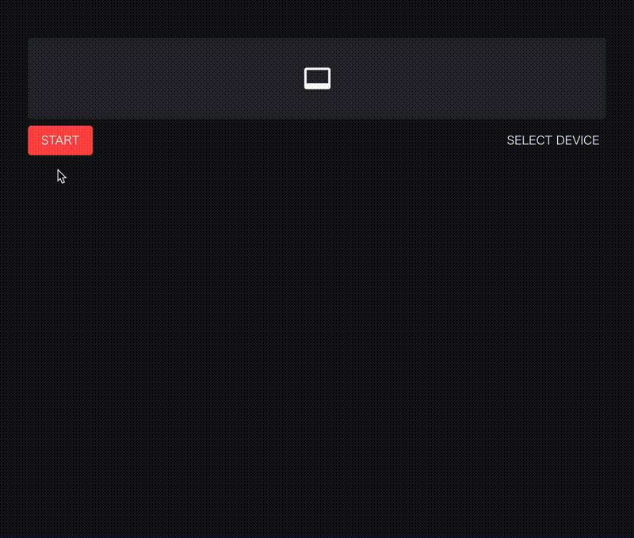

# streamlit-webrtc
**Handling and transmitting real-time video/audio streams over the network with Streamlit** [](https://share.streamlit.io/whitphx/streamlit-webrtc-example/main/app.py)

[](https://github.com/whitphx/streamlit-webrtc/actions?query=workflow%3ATests+branch%3Amain)
[](https://github.com/whitphx/streamlit-webrtc/actions?query=workflow%3A%22Frontend+tests%22+branch%3Amain)
[](https://github.com/astral-sh/ruff)

[](https://pypi.org/project/streamlit-webrtc/)
[](https://pypi.org/project/streamlit-webrtc/)
[](https://pypi.org/project/streamlit-webrtc/)
[](https://pypi.org/project/streamlit-webrtc/)

<table>
<tr>
<td width="48%">
  <a href="https://share.streamlit.io/whitphx/streamlit-webrtc-example/main/app.py">
    
  </a>
</td>
<td width="48%">
  <a href="https://share.streamlit.io/whitphx/style-transfer-web-app/main/app.py">
    
  </a>
</td>
</tr>
</table>

Sister project: [`streamlit-fesion`](https://github.com/whitphx/streamlit-fesion) to execute video filters on browsers with Wasm.

## Examples
### [⚡️Showcase including following examples and more](https://github.com/whitphx/streamlit-webrtc-example): [🎈Online demo](https://share.streamlit.io/whitphx/streamlit-webrtc-example/main/app.py)

* Object detection
* OpenCV filter
* Uni-directional video streaming
* Audio processing

### [⚡️Real-time Speech-to-Text](https://github.com/whitphx/streamlit-stt-app): [🎈Online demo](https://share.streamlit.io/whitphx/streamlit-stt-app/main/app_deepspeech.py)

It converts your voice into text in real time.
This app is self-contained; it does not depend on any external API.

### [⚡️Real-time video style transfer](https://github.com/whitphx/style-transfer-web-app): [🎈Online demo](https://share.streamlit.io/whitphx/style-transfer-web-app/main/app.py)
It applies a wide variety of style transfer filters to real-time video streams.

### [⚡️Video chat](https://github.com/whitphx/streamlit-video-chat-example)
(Online demo not available)

You can create video chat apps with ~100 lines of Python code.

### [⚡️Tokyo 2020 Pictogram](https://github.com/whitphx/Tokyo2020-Pictogram-using-MediaPipe): [🎈Online demo](https://share.streamlit.io/whitphx/tokyo2020-pictogram-using-mediapipe/streamlit-app)
[MediaPipe](https://google.github.io/mediapipe/) is used for pose estimation.

## Install
```shell
$ pip install -U streamlit-webrtc
```

## Quick tutorial

See also [the sample pages, `pages/*.py`](https://github.com/whitphx/streamlit-webrtc/tree/main/pages), which contain a wide variety of usage.

See also ["Developing Web-Based Real-Time Video/Audio Processing Apps Quickly with Streamlit"](https://towardsdatascience.com/developing-web-based-real-time-video-audio-processing-apps-quickly-with-streamlit-7c7bcd0bc5a8).

---

Create `app.py` with the content below.
```py
from streamlit_webrtc import webrtc_streamer

webrtc_streamer(key="sample")
```
Unlike other Streamlit components, `webrtc_streamer()` requires the `key` argument as a unique identifier. Set an arbitrary string to it.

Then run it with Streamlit and open http://localhost:8501/.
```shell
$ streamlit run app.py
```

You see the app view, so click the "START" button.

Then, video and audio streaming starts. If asked for permissions to access the camera and microphone, allow it.


Next, edit `app.py` as below and run it again.
```py
from streamlit_webrtc import webrtc_streamer
import av


def video_frame_callback(frame):
    img = frame.to_ndarray(format="bgr24")

    flipped = img[::-1,:,:]

    return av.VideoFrame.from_ndarray(flipped, format="bgr24")


webrtc_streamer(key="example", video_frame_callback=video_frame_callback)
```

Now the video is vertically flipped.


As an example above, you can edit the video frames by defining a callback that receives and returns a frame and passing it to the `video_frame_callback` argument (or `audio_frame_callback` for audio manipulation).
The input and output frames are the instance of [`av.VideoFrame`](https://pyav.org/docs/develop/api/video.html#av.video.frame.VideoFrame) (or [`av.AudioFrame`](https://pyav.org/docs/develop/api/audio.html#av.audio.frame.AudioFrame) when dealing with audio) of [`PyAV` library](https://pyav.org/).

You can inject any kinds of image (or audio) processing inside the callback.
See examples above for more applications.

### Pass parameters to the callback

You can also pass parameters to the callback.

In the example below, a boolean `flip` flag is used to turn on/off the image flipping.
```python
import streamlit as st
from streamlit_webrtc import webrtc_streamer
import av


flip = st.checkbox("Flip")


def video_frame_callback(frame):
    img = frame.to_ndarray(format="bgr24")

    flipped = img[::-1,:,:] if flip else img

    return av.VideoFrame.from_ndarray(flipped, format="bgr24")


webrtc_streamer(key="example", video_frame_callback=video_frame_callback)
```

### Pull values from the callback

Sometimes we want to read the values generated in the callback from the outer scope.

Note that the callback is executed in a forked thread running independently of the main script, so we have to take care of the following points and need some tricks for implementation like the example below (See also the section below for some limitations in the callback due to multi-threading).

* Thread-safety
  * Passing the values between inside and outside the callback must be thread-safe.
* Using a loop to poll the values
  * During media streaming, while the callback continues to be called, the main script execution stops at the bottom as usual. So we need to use a loop to keep the main script running and get the values from the callback in the outer scope.

The following example is to pass the image frames from the callback to the outer scope and continuously process it in the loop. In this example, a simple image analysis (calculating the histogram like [this OpenCV tutorial](https://docs.opencv.org/4.x/d1/db7/tutorial_py_histogram_begins.html)) is done on the image frames.

[`threading.Lock`](https://docs.python.org/3/library/threading.html#lock-objects) is one standard way to control variable accesses across threads.
A dict object `img_container` here is a mutable container shared by the callback and the outer scope and the `lock` object is used at assigning and reading the values to/from the container for thread-safety.

```python
import threading

import cv2
import streamlit as st
from matplotlib import pyplot as plt

from streamlit_webrtc import webrtc_streamer

lock = threading.Lock()
img_container = {"img": None}


def video_frame_callback(frame):
    img = frame.to_ndarray(format="bgr24")
    with lock:
        img_container["img"] = img

    return frame


ctx = webrtc_streamer(key="example", video_frame_callback=video_frame_callback)

fig_place = st.empty()
fig, ax = plt.subplots(1, 1)

while ctx.state.playing:
    with lock:
        img = img_container["img"]
    if img is None:
        continue
    gray = cv2.cvtColor(img, cv2.COLOR_BGR2GRAY)
    ax.cla()
    ax.hist(gray.ravel(), 256, [0, 256])
    fig_place.pyplot(fig)
```

## Callback limitations
The callbacks are executed in forked threads different from the main one, so there are some limitations:
* Streamlit methods (`st.*` such as `st.write()`) do not work inside the callbacks.
* Variables inside the callbacks cannot be directly referred to from the outside.
* The `global` keyword does not work expectedly in the callbacks.
* You have to care about thread-safety when accessing the same objects both from outside and inside the callbacks as stated in the section above.

## Class-based callbacks
Until v0.37, the class-based callbacks were the standard.
See the [old version of the README](https://github.com/whitphx/streamlit-webrtc/blob/v0.37.0/README.md#quick-tutorial) about it.

## Serving from remote host
When deploying apps to remote servers, there are some things you need to be aware of.
In short,
* HTTPS is required to access local media devices.
* STUN/TURN servers are required to establish the media stream connection.

See the following sections.

### HTTPS
`streamlit-webrtc` uses [`getUserMedia()`](https://developer.mozilla.org/en-US/docs/Web/API/MediaDevices/getUserMedia) API to access local media devices, and this method does not work in an insecure context.

[This document](https://developer.mozilla.org/en-US/docs/Web/API/MediaDevices/getUserMedia#privacy_and_security) says
> A secure context is, in short, a page loaded using HTTPS or the file:/// URL scheme, or a page loaded from localhost.

So, when hosting your app on a remote server, it must be served via HTTPS if your app is using webcam or microphone.
If not, you will encounter an error when starting using the device. For example, it's something like below on Chrome.
> Error: navigator.mediaDevices is undefined. It seems the current document is not loaded securely.

[Streamlit Community Cloud](https://streamlit.io/cloud) is a recommended way for HTTPS serving. You can easily deploy Streamlit apps with it, and most importantly for this topic, it serves the apps via HTTPS automatically by default.

For the development purpose, sometimes [`suyashkumar/ssl-proxy`](https://github.com/suyashkumar/ssl-proxy) is a convenient tool to serve your app via HTTPS.
```shell
$ streamlit run your_app.py  # Assume your app is running on http://localhost:8501
# Then, after downloading the binary from the GitHub page above to ./ssl-proxy,
$ ./ssl-proxy -from 0.0.0.0:8000 -to 127.0.0.1:8501  # Proxy the HTTP page from port 8501 to port 8000 via HTTPS
# Then access https://localhost:8000
```

### Configure the STUN server
To deploy the app to the cloud, we have to configure the *STUN* server via the `rtc_configuration` argument on `webrtc_streamer()` like below.

```python
webrtc_streamer(
    # ...
    rtc_configuration={  # Add this config
        "iceServers": [{"urls": ["stun:stun.l.google.com:19302"]}]
    }
    # ...
)
```

This configuration is necessary to establish the media streaming connection when the server is on a remote host.

:warning: You may need to set up a TURN server as well in some environments, **including Streamlit Community Cloud**. See also the next section.

`streamlit_webrtc` uses WebRTC for its video and audio streaming. It has to access a "STUN server" in the global network for the remote peers (precisely, peers over the NATs) to establish WebRTC connections.
As we don't see the details about STUN servers here, please google it if interested with keywords such as STUN, TURN, or NAT traversal, or read these articles ([1](https://towardsdatascience.com/developing-web-based-real-time-video-audio-processing-apps-quickly-with-streamlit-7c7bcd0bc5a8#1cec), [2](https://dev.to/whitphx/python-webrtc-basics-with-aiortc-48id), [3](https://www.3cx.com/pbx/what-is-a-stun-server/)).

The example above is configured to use `stun.l.google.com:19302`, which is a free STUN server provided by Google.

You can also use any other STUN servers.
For example, [one user reported](https://github.com/whitphx/streamlit-webrtc/issues/283#issuecomment-889753789) that the Google's STUN server had a huge delay when using from China network, and the problem was solved by changing the STUN server.

For those who know about the browser WebRTC API: The value of the rtc_configuration argument will be passed to the [`RTCPeerConnection`](https://developer.mozilla.org/en-US/docs/Web/API/RTCPeerConnection/RTCPeerConnection) constructor on the frontend.

### Configure the TURN server if necessary
Even if the STUN server is properly configured, media streaming may not work in some network environments, either from the server or from the client.
For example, if the server is hosted behind a proxy, or if the client is on an office network behind a firewall, the WebRTC packets may be blocked (**Streamlit Community Cloud is the case**). [This article](https://blog.addpipe.com/troubleshooting-webrtc-connection-issues/#steptwodiscoverystunandturn) summarizes the possible situations.

In such environments, [TURN server](https://webrtc.org/getting-started/turn-server) is required.

There are several options for setting up a TURN server:
* [Twilio Network Traversal Service](https://www.twilio.com/docs/stun-turn) (_recommended_) is a stable and easy-to-use solution. It's a paid service, but you can start with a free trial with a certain amount of credit.
  You can simply pass the `ice_servers` field of the [Network Traversal Service Tokens API](https://www.twilio.com/docs/api/2010-04-01/rest/token) response to the `iceServers` field of the `rtc_configuration` argument of `webrtc_streamer()`.
  ```python
  ## This sample code is from https://www.twilio.com/docs/stun-turn/api
  # Download the helper library from https://www.twilio.com/docs/python/install
  import os
  from twilio.rest import Client

  # Find your Account SID and Auth Token at twilio.com/console
  # and set the environment variables. See http://twil.io/secure
  account_sid = os.environ['TWILIO_ACCOUNT_SID']
  auth_token = os.environ['TWILIO_AUTH_TOKEN']
  client = Client(account_sid, auth_token)

  token = client.tokens.create()

  # Then, pass the ICE server information to webrtc_streamer().
  webrtc_streamer(
    # ...
    rtc_configuration={
        "iceServers": token.ice_servers
    }
    # ...
  )
  ```
  The [WebRTC sample app hosted on the Community Cloud](https://webrtc.streamlit.app/) uses this option. See [how it retrieves the ICE server information from the Twilio API](https://github.com/whitphx/streamlit-webrtc-example/blob/79ac65994a8c7f91475647d65e63b5040ea35863/sample_utils/turn.py) and [how to use it in the app](https://github.com/whitphx/streamlit-webrtc-example/blob/79ac65994a8c7f91475647d65e63b5040ea35863/pages/1_object_detection.py#L141).
* The [Open Relay Project](https://www.metered.ca/tools/openrelay/) provides a free TURN server. However, it does not seem to be stable enough and is often down.
* A self-hosted TURN server is also an option. See https://github.com/whitphx/streamlit-webrtc/issues/335#issuecomment-897326755.

## Logging
For logging, this library uses the standard `logging` module and follows the practice described in [the official logging tutorial](https://docs.python.org/3/howto/logging.html#advanced-logging-tutorial). Then the logger names are the same as the module names - `streamlit_webrtc` or `streamlit_webrtc.*`.

So you can get the logger instance with `logging.getLogger("streamlit_webrtc")` through which you can control the logs from this library.

For example, if you want to set the log level on this library's logger as WARNING, you can use the following code.
```python
st_webrtc_logger = logging.getLogger("streamlit_webrtc")
st_webrtc_logger.setLevel(logging.WARNING)
```

In practice, `aiortc`, a third-party package this library is internally using, also emits many INFO level logs and you may want to control its logs too.
You can do it in the same way as below.
```python
aioice_logger = logging.getLogger("aioice")
aioice_logger.setLevel(logging.WARNING)
```

## API changes
Currently there is no documentation about the interface. See the examples in [./pages/*.py](./pages) for the usage.
The API is not finalized yet and can be changed without backward compatibility in the future releases until v1.0.

### For users since versions `<0.20`
`VideoTransformerBase` and its `transform` method have been marked as deprecated in v0.20.0. Please use `VideoProcessorBase#recv()` instead.
Note that the signature of the `recv` method is different from the `transform` in that the `recv` has to return an instance of `av.VideoFrame` or `av.AudioFrame`.

Also, `webrtc_streamer()`'s `video_transformer_factory` and `async_transform` arguments are deprecated, so use `video_processor_factory` and `async_processing` respectively.

See the samples in [app.py](./app.py) for their usage.

## Resources
* [Developing web-based real-time video/audio processing apps quickly with Streamlit](https://www.whitphx.info/posts/20211231-streamlit-webrtc-video-app-tutorial/)
  * A tutorial for real-time video app development using `streamlit-webrtc`.
  * Crosspost on dev.to: https://dev.to/whitphx/developing-web-based-real-time-videoaudio-processing-apps-quickly-with-streamlit-4k89
* [New Component: streamlit-webrtc, a new way to deal with real-time media streams (Streamlit Community)](https://discuss.streamlit.io/t/new-component-streamlit-webrtc-a-new-way-to-deal-with-real-time-media-streams/8669)
  * This is a forum topic where `streamlit-webrtc` has been introduced and discussed about.


## Support the project
[](https://ko-fi.com/D1D2ERWFG)

<a href="https://www.buymeacoffee.com/whitphx" target="_blank" rel="noreferrer"></a>

[](https://github.com/sponsors/whitphx)
