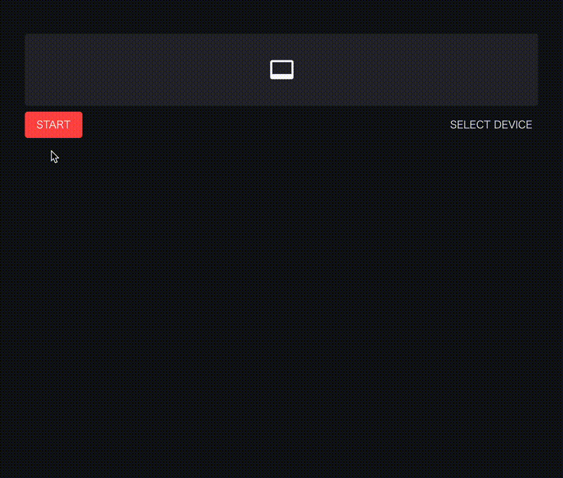

# Tutorial

Learn how to build real-time video processing apps with Streamlit-WebRTC step by step.

## Basic Usage

Create `app.py` with the content below:

```python title="app.py"
--8<-- "./examples/tutorial/01_basic_usage.py"
```

Unlike other Streamlit components, `webrtc_streamer()` requires the `key` argument as a unique identifier. Set an arbitrary string to it.

Then run it with Streamlit and open <http://localhost:8501/>:

```bash
streamlit run app.py
```

You see the app view, so click the "START" button.

Then, video and audio streaming starts. If asked for permissions to access the camera and microphone, allow it.



## Media Toggle Controls

When the app sends local camera or microphone input, `webrtc_streamer()` shows camera and microphone toggle buttons next to the Start/Stop button. These controls let users turn their outgoing camera or microphone track on and off without stopping the WebRTC session.

Set `media_toggle_controls=False` to hide these toggle buttons:

```python
from streamlit_webrtc import webrtc_streamer

webrtc_streamer(key="example", media_toggle_controls=False)
```

When a user turns off the camera or microphone with these buttons, the WebRTC track stays active. As described in MDN's [`MediaStreamTrack.enabled` documentation](https://developer.mozilla.org/en-US/docs/Web/API/MediaStreamTrack/enabled), disabled audio tracks send silence, and disabled video tracks send black frames; the session does not stop or renegotiate.

## Adding Video Processing

Next, edit `app.py` as below and run it again:

```python title="app.py"
--8<-- "./examples/tutorial/02_video_processing.py"
```

Now the video is vertically flipped.


As shown in this example, you can edit the video frames by defining a callback that receives and returns a frame and passing it to the `video_frame_callback` argument (or `audio_frame_callback` for audio manipulation).

The input and output frames are instances of [`av.VideoFrame`](https://pyav.org/docs/develop/api/video.html#av.video.frame.VideoFrame) (or [`av.AudioFrame`](https://pyav.org/docs/develop/api/audio.html#av.audio.frame.AudioFrame) when dealing with audio) from the [`PyAV` library](https://pyav.org/).

You can inject any kinds of image (or audio) processing inside the callback.

## Pass Parameters to the Callback

You can also pass parameters to the callback.

In the example below, a boolean `flip` flag is used to turn on/off the image flipping:

```python title="app.py"
--8<-- "./examples/tutorial/03_parameters.py"
```

## Pull Values from the Callback

Sometimes we want to read the values generated in the callback from the outer scope.

Note that the callback is executed in a forked thread running independently of the main script, so we have to take care of the following points and need some tricks for implementation like the example below:

* **Thread-safety** - Passing the values between inside and outside the callback must be thread-safe.
* **Using a loop to poll the values** - During media streaming, while the callback continues to be called, the main script execution stops at the bottom as usual. So we need to use a loop to keep the main script running and get the values from the callback in the outer scope.

The following example passes the image frames from the callback to the outer scope and continuously processes them in a loop. In this example, simple image analysis (calculating the histogram) is done on the image frames:

```python title="app.py"
--8<-- "./examples/tutorial/04_pull_values.py"
```

[`threading.Lock`](https://docs.python.org/3/library/threading.html#lock-objects) is one standard way to control variable accesses across threads. A dict object `img_container` here is a mutable container shared by the callback and the outer scope and the `lock` object is used at assigning and reading the values to/from the container for thread-safety.

## Callback Limitations

The callbacks are executed in forked threads different from the main one, so there are some limitations:

* Streamlit methods (`st.*` such as `st.write()`) do not work inside the callbacks.
* Variables inside the callbacks cannot be directly referred to from the outside.
* The `global` keyword does not work expectedly in the callbacks.
* You have to care about thread-safety when accessing the same objects both from outside and inside the callbacks as stated in the section above.

## Cleanup on Stop

`webrtc_streamer()` accepts `on_video_ended` and `on_audio_ended` arguments — zero-argument callables that fire when the corresponding input media track ends (the user clicks "STOP", closes the page, or the connection drops). They are the recommended hook for tearing down per-session resources that the frame callbacks allocated, such as worker threads, model handles, file writers, queues, or `st.session_state` entries:

```python title="app.py"
--8<-- "./examples/tutorial/05_cleanup.py"
```

These callbacks run on `aiortc`'s asyncio loop — not Streamlit's main thread — so the same caveats as the frame callbacks apply: `st.*` calls do not work inside them, and shared state must be mutated in a thread-safe way (e.g. with a `threading.Lock`, a `queue`, or a `threading.Event`).

When using the class-based API (`video_processor_factory` / `audio_processor_factory`), override `VideoProcessorBase.on_ended()` / `AudioProcessorBase.on_ended()` instead — they fire at the same lifecycle point.

## Source/Sink Track Lifecycle

The source/sink factory helpers cache their returned objects by `key` so they survive Streamlit reruns. By default, these cached objects are scoped to the active WebRTC session: when the user clicks STOP, closes the page, or the connection drops, the cached source/sink object is stopped and removed from `st.session_state`.

```python
from streamlit_webrtc import create_video_source_track

video_track = create_video_source_track(
    callback=video_source_callback,
    key="video-source",
)
```

To keep a factory-created object alive across multiple WebRTC sessions in the same Streamlit session, opt out with `lifecycle_scope="streamlit-session"`:

```python
video_track = create_video_source_track(
    callback=video_source_callback,
    key="video-source",
    lifecycle_scope="streamlit-session",
)
```

`lifecycle_scope` applies to source/sink factory helpers and `create_pcm_audio_source_track()`. It does not affect `webrtc_streamer()`, `create_process_track()`, or `create_mix_track()`, whose lifecycles are tied to input tracks or explicit mixer reuse.

## Ready for Production?

When you're ready to deploy your app, see the [Deployment Guide](deployment.md) for:

- HTTPS configuration requirements
- STUN/TURN server setup
- Platform-specific deployment instructions
- Troubleshooting common issues
